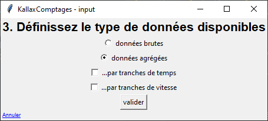

# KallaxComptages

KallaxComptages est un programme développé dans le cadre de mon travail de Bachelor à l'Université de Fribourg, 2022-2023.
Son but : faciliter la **standardisation**, le **stockage** et l'**analyse** de **données de mobilité** issues de **comptages routiers**.
Son concept est le suivant :
- L'utilisateur.trice entre un fichier présentant des données issues d'un comptage routier.
- L'utilisateur.trice entre les spécifications propre au fichier : type de données, colonnes à utiliser, localisation du comptage...
- Le programme s'occupe de la standardisation des données et les insère dans sa base de données.
- L'utilisateur.trice a ensuite à sa disposition des possibilités pour trouver facilement les informations voulues (sous forme de graphiques, de cartes, de chiffres bruts...).
- L'application peut aussi offrir des fonctionnalités plus avancées, telles que du data cleaning ou de la détection d'erreurs.

## Spécifications techniques

- **Python** - Langage dans lequel est entièrement écrit l'application. Librairies utilisées :
    - **tkinter**, **tkintermapview**, **tkcalendar** - Interface de l'application
    - **numpy**, **pandas** - Traitement numérique de l'information
    - **openpyxl** - Support de l'input de fichiers Excel
    - **datefinder** - Analyse de dates en format texte
    - **pyinstaller** - Compilation du programme en exécutable
- **SQLite** - Moteur de base de données utilisé. La BDD est donc enregistrée sous forme de fichier indépendant

## To-do

- Toute la partie "sélection des données" pour l'analyse
- Toute la partie analyse
- Fonctionnalités plus avancées (data cleaning, détection d'erreurs...)
- Prise en compte du sens de circulation
- Standardisation des types de véhicules (ne donner le choix que parmi une liste établie)
- Esthétique générale

## Installation et utilisation

KallaxComptages ne nécessite pas vraiment d'installation. Il suffit de copier le dossier **XXX** sur votre machine, puis de lancer l'exécutable (.exe).

Une fois l'exécutable lancé, la fenêtre suivante apparait :
**SCREENSHOT**

### Ajout de données

#### Partie 1 : Choix du fichier

 La première étape consiste à choisir le fichier contenant les informations à introduire dans la base de données.
 Le fichier peut être au format .xlsx ou .csv.

#### Partie 2 : Choix de la feuille à utiliser

 Si le fichier choisi est au format .xlsx, cette étape consiste à choisir la feuille à utiliser.
 Si le fichier est au format .csv, le programme détermine automatiquement le séparateur des colonnes et passe à l'étape suivante sans intervention de l'utilisateur.trice.

#### Partie 3 : Choix du type de données présentes

 Cette étape consiste à spécifier le type de données présent dans le fichier. Il y a 3 types de données possibles :
- Données brutes : chaque passage de véhicule est enregistré sur sa propre ligne.
- Données agrégées par temps : chaque ligne représente les passages de véhicule sur une certaine période de temps, par exemple par tranches d'1h.
- Données agrégées par vitesse : chaque ligne représente les passages de véhicule ayant eu une certaine vitesse, par exemple par tranches de 5 km/h.

Si des données brutes sont disponibles, le programme n'a pas besoin de données agrégées, d'où la sélection unique dans le menu. Autrement, il faut spécifier si les données à disposition sont agrégées par temps, par heure, ou si les deux types sont présents.

#### Partie 4 : Choix des lignes à utiliser

 Cette étape consiste à spécifier les numéros de ligne du fichier à utiliser. Elle permet d'éviter de prendre en compte les éventuels en-têtes et lignes superflues contenues dans le fichier.
 Par défaut, les lignes non-vides du fichier sont prises en compte.
 Le contenu de la fenêtre varie en fonction des types de données spécifiées à l'étape 3.

#### Partie 5 : Choix des colonnes de temps et/ou de vitesse

 Cette étape consiste à spécifier les numéros/lettres des colonnes contenant l'information des tranches de temps et/ou de vitesse (en fonction du type de données agrégées sélectionnées).
 Elle est automatiquement passée si le type de données a été défini sur "brutes" à l'étape 3.

#### Partie 6 : Choix des colonnes à utiliser

 Cette étape consiste à spécifier les numéros/lettres des colonnes contenant les informations présentes dans le fichier.
 Le contenu de la fenêtre varie en fonction des types de données spécifiées à l'étape 3.
 Si des données agrégées par tranches de vitesse sont présentes, il est également demandé d'entrer le jour où le comptage a été effectué.

#### Partie 7 : Choix de la localisation du comptage routier

 Cette étape consiste à préciser la localisation exacte du comptage routier, sous forme de pointeur sur une carte.

#### Partie 8 : Récapitulatif des données à entrer

 Cette étape consiste simplement à vérifier si les informations entrées précédemment sont correctes. Pour ce faire, le programme génère un récapitulatif contenant tout ce qui a été spécifié aux étapes précédentes.

Une fois l'étape 8 validée, les données sont envoyées dans la base de données. Ceci peut prendre un peu de temps, en particulier si le comptage contient une grande quantité de données.
 Il est recommandé de ne pas fermer le programme tant que la fenêtre "Données envoyées à la base de données !" n'est pas apparu.

### Analyse de données
À écrire quand le programme le permettra..

## Contribuer au développement